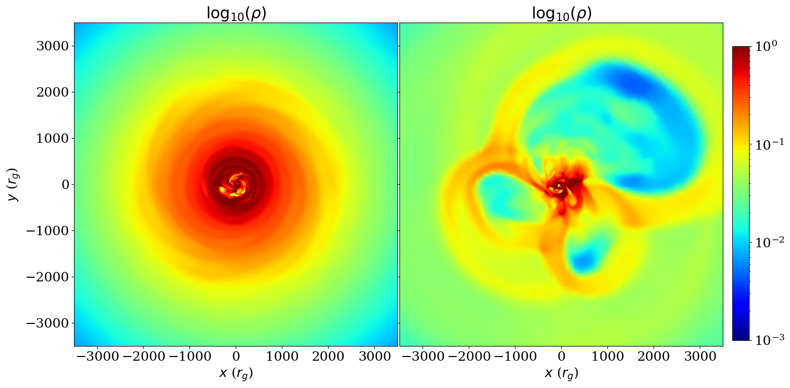
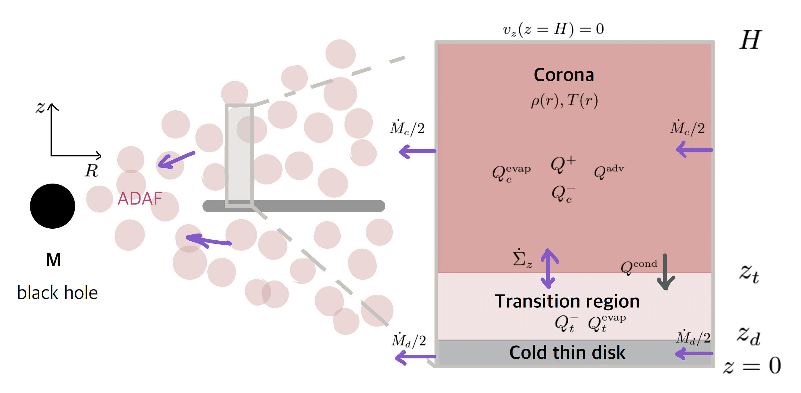

I am a Ph.D. student at Harvard Astronomy and I am originally from Korea. I am interested in studying the accretion of highly energetic plasma onto black holes using analytical models and general relativistic magnetohydrodynamic (GRMHD) simulations. Below is the summary of my research projects.

<header>
    <h2>Bridging Scales in Black Hole (BH) Accretion and Feedback</h2>
    

    <iframe width="560" height="315" src="https://www.youtube.com/embed/jW69PyerCVk?si=WcrdT2CsT7cLzrVA?autoplay=1&loop=1" title="YouTube video player" frameborder="0" allow="accelerometer; autoplay; clipboard-write; encrypted-media; gyroscope; picture-in-picture; web-share" referrerpolicy="strict-origin-when-cross-origin" allowfullscreen></iframe>
    

    In a series of papers (<a href="https://iopscience.iop.org/article/10.3847/2041-8213/ad1048">Cho+23</a>,<a href="https://iopscience.iop.org/article/10.3847/1538-4357/ad9561">24</a>,<a href="https://ui.adsabs.harvard.edu/abs/2025arXiv250717818C/abstract">25</a>), we have tackled an extremely challenging problem of connecting the physics of BH accretion and jet feedback near the event horizon to the evolution of galaxies on kiloparsec scales. We pioneered the <b>multizone</b> method in general relativistic magnetohydrodynamic (GRMHD) simulations, a breakthrough that overcomes the timestep barrier in traditional simulations. This allowed simulating the full accretion and feedback loop from the BH horizon to galactic environment, spanning up to nine orders of magnitude in spatial scale.
    Crucially, we provided physically grounded prescriptions for AGN feedback that can be adopted into cosmological and galaxy-scale simulations, enabling more realistic modeling of BH–galaxy co-evolution across cosmic time.
 
</header>

<header>
    <h2>Black Hole Jet Intermittency in Hot Accretion Flows</h2>
    

    <figure>
  
  <figcaption>Equatorial slices of (left) weakly variable and (right) strongly variable BH simulations.</figcaption>
</figure>
In <a href="https://ui.adsabs.harvard.edu/abs/2025arXiv250713441C/abstract">Cho & Narayan (2025)</a>, we investigated the origin of variability in BH accretion by modifying traditional GRMHD torus simulations. By increasing torus size and magnetic field strength across various BH spins, we find that strong magnetic fields — not size alone — trigger large fluctuations in jet power and gas rotation. We identify the ratio of rotational to magnetic energy in the initial state as a key driver of this behavior. We suggest that all hot accretion flows may eventually produce intermittent jets.
    

</header>

<header>
    <h2>Analytical Model of State Transitions in Accreting Black Holes</h2>
    

    <figure>
    
  <figcaption>Schematics of the analytical model where the thin disk evaporates to hot accretion flows.</figcaption>
  </figure>
    <a href="https://iopscience.iop.org/article/10.3847/1538-4357/ac6d5c">Cho & Narayan (2022)</a> present an analytical model of disk evaporation that explains spectral state transitions in accreting BHs. The model identifies a critical radius where the thin disk evaporates into a hot corona, and a critical accretion rate that sets the threshold for transitions between hard and soft states.
    

</header>

<header>
    <h2>Fast Radio Bursts (FRBs) at Microsecond Resolution</h2>
    

        <figure>
    
  <figcaption>High resolution FRB time series at microsecond timescales.</figcaption>
  </figure>
    <a href="https://iopscience.iop.org/article/10.3847/2041-8213/ab7824">Cho et al. (2020)</a> developed a method to analyze FRBs at high-time resolutions, resolving microsecond-scale structure and polarization changes within individual pulses. They found variable rotation measures, suggesting interaction with a relativistic plasma near the source. The results constrain FRB emission mechanisms and highlight the power of ultra-fast polarimetric observations.
    

</header>